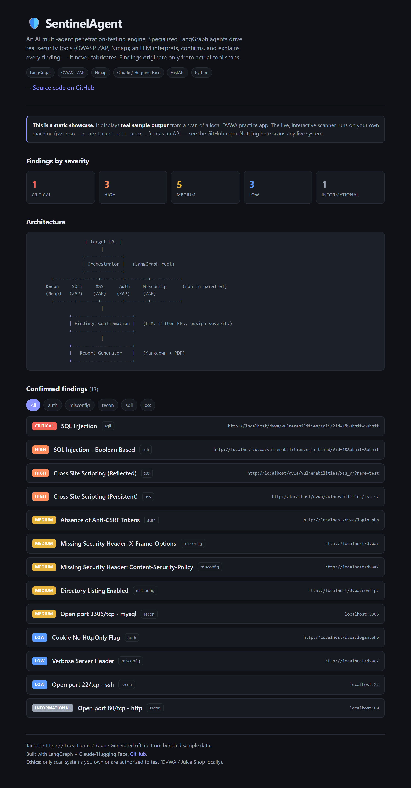
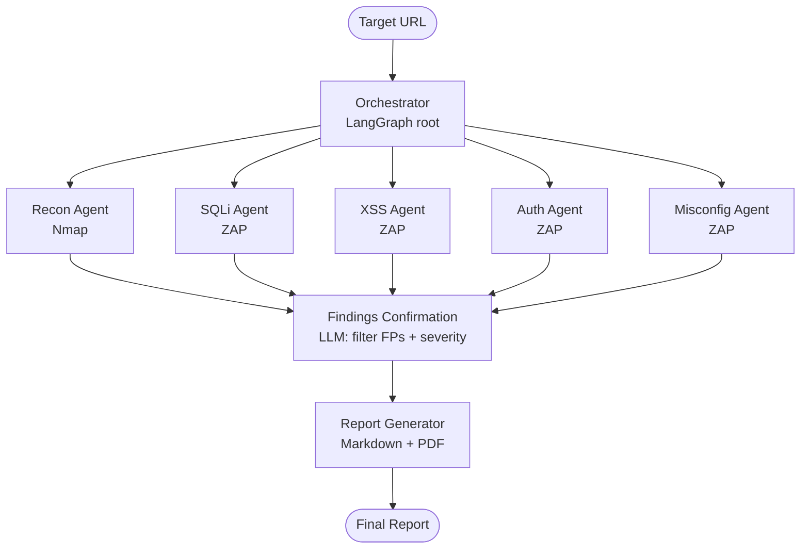

<div align="center">

# 🛡️ SentinelAgent

### AI Multi-Agent Penetration Testing Engine

**Specialized LangGraph agents drive real security tools (OWASP ZAP, Nmap); an LLM interprets, confirms, and explains every finding — it never fabricates.**

[](https://github.com/vikas-dev-123/sentinel-agent/actions/workflows/ci.yml)


[**🚀 Live Demo**](https://sentinel-agent-43sv.onrender.com/) · [Quickstart](#-quickstart) · [How it works](#-how-it-works) · [Sample report](docs/sample-report.md)

<br/>



*Confirmed findings ranked by severity, filtered of false positives — [try the live app →](https://sentinel-agent-43sv.onrender.com/)*

</div>

---

## Overview

**SentinelAgent** automates web-application security testing. A [LangGraph](https://langchain-ai.github.io/langgraph/) graph orchestrates specialized AI agents — each responsible for one vulnerability category. Every agent drives a **real security tool** (OWASP ZAP or Nmap), and an LLM (Claude / Hugging Face / Ollama) **interprets, confirms, and explains** the tool output, filtering false positives and producing a structured penetration-test report.

> **🔑 Core principle:** Agents never guess vulnerabilities from LLM knowledge. **Every finding originates from an actual tool scan.** The LLM's job is to *interpret, confirm, and explain* — never to fabricate.

## ✨ Features

- **🕸️ Multi-agent orchestration** — 6 specialized agents run in parallel via LangGraph with shared state
- **🔧 Real tools, not guesses** — OWASP ZAP (active scan) + Nmap (service discovery) drive every finding
- **🧠 Pluggable LLM reasoning** — Claude, Hugging Face, Ollama, or an offline heuristic (auto-fallback)
- **🎯 False-positive filtering** — a dedicated confirmation agent filters scanner noise and assigns severity
- **📄 Structured reports** — professional Markdown + PDF output with evidence and remediation
- **🔌 CLI, REST API, and Web UI** — three ways to run it
- **⚖️ Built-in scope guard** — refuses to scan anything but approved practice targets or hosts you own
- **♻️ Runs anywhere** — full offline demo with bundled sample data, or live with real tools

## 🏗️ Architecture



Each category agent follows one pattern:

> **call tool → get raw output → interpret with a narrow, category-specific LLM prompt → emit structured findings** into shared graph state.

## 🚀 Quickstart

No ZAP, no Nmap, no API key needed — the offline demo runs on bundled sample data:

```bash
git clone https://github.com/vikas-dev-123/sentinel-agent.git
cd sentinel-agent
pip install -r requirements.txt

# Full pipeline (offline):
python -m sentinel.cli scan http://localhost/dvwa --mock

# Web UI:
python app.py                       # -> http://localhost:7860

# REST API:
uvicorn sentinel.api:app --reload   # -> POST /scan, GET /health
```

Reports (Markdown + PDF) land in `reports/`. See a [**sample report**](docs/sample-report.md).

## ⚙️ How it works

| Stage | Agent(s) | Tool | What happens |
|---|---|---|---|
| Recon | Recon | Nmap | Discover open ports / services |
| Scan | SQLi · XSS · Auth · Misconfig | OWASP ZAP | Active scan for each vulnerability class (parallel) |
| Confirm | Findings Confirmation | LLM | Filter false positives, deduplicate, assign severity |
| Report | Report Generator | — | Executive summary → findings table → detailed write-ups → PDF |

### Pluggable reasoning backends

Set `SENTINEL_LLM_PROVIDER` = `auto` (default) · `claude` · `hf` · `ollama` · `groq` · `heuristic`.

| Backend | Cost | Notes |
|---|---|---|
| **Claude** (`claude-opus-5`) | paid | best reasoning / report prose |
| **Hugging Face** | free tier | any chat model via the OpenAI-compatible router |
| **Groq** | free tier | fast open models (Llama, etc.) |
| **Ollama** | free / local | run models on your own machine |
| **heuristic** | free | deterministic, no LLM — always works offline |

If an LLM call fails, it falls back to the heuristic so a run never breaks.

**💡 Cost/model routing** — route the cheap *parse raw output → JSON* step and the reasoning-heavy *confirm + report* step to different backends:

```bash
export SENTINEL_PARSE_PROVIDER=groq      # fast + cheap for structured extraction
export SENTINEL_REASON_PROVIDER=claude   # strong reasoning for confirmation + prose
```

## 🧪 Real-world example: catching false positives

Pointed at a real Next.js/Vercel site, a naïve scanner flagged `/.env` and `/.git/config` as **HIGH — exposed**. SentinelAgent's verification caught that these returned the app's HTML (SPA catch-all routing), **discarded both as false positives**, and reported only the genuine issues — missing `Content-Security-Policy`, `X-Frame-Options`, and tech-stack disclosure. *This is exactly what the confirmation agent is for.*

## 🛠️ Tech stack

| Layer | Choice |
|---|---|
| Orchestration | LangGraph |
| LLM | Claude · Hugging Face · Ollama (+ heuristic fallback) |
| Scanning | OWASP ZAP (REST API) · Nmap |
| API | FastAPI |
| UI | Gradio |
| Reporting | Jinja2 · ReportLab (PDF) |

## 📁 Project structure

```
sentinel/
  config.py          # settings + scope/authorization enforcement
  state.py           # shared LangGraph state (TypedDict + reducers)
  llm/               # LLM client (Claude/HF/Ollama) + heuristic + prompts
  tools/             # ZAP and Nmap wrappers (live + sample fallback)
  agents/            # recon, scanners, confirmation, report
  reporting/         # Markdown template + Markdown->PDF
  orchestrator.py    # LangGraph graph wiring
  cli.py             # command-line entrypoint
  api.py             # FastAPI layer
app.py               # Gradio web UI
scripts/             # phase-1 demo + static-site builder
sample_data/         # realistic ZAP/Nmap output for offline runs
tests/               # end-to-end pipeline tests
```

## 🔬 Running against real targets

```bash
docker compose up -d          # DVWA (:8081), Juice Shop (:3000), ZAP (:8080)

# Real ZAP scan of a local practice app:
SENTINEL_MOCK=0 python -m sentinel.cli scan http://localhost:8081

# A site you OWN (with authorization):
SENTINEL_ALLOW_ANY=1 SENTINEL_MOCK=0 ZAP_API_URL=http://localhost:8080 \
  python -m sentinel.cli scan https://your-own-site.com
```

## ✅ Tests

```bash
python -m pytest tests/ -q      # 5 passed
```

## 🗺️ Roadmap

- [x] Cost-routed multi-model pipeline (cheap parse + strong reasoning)
- [x] Surface live-vs-fallback status explicitly in output
- [ ] Authenticated scanning (session/cookie injection for logged-in areas)
- [ ] More OWASP WSTG categories (CSRF, SSRF, access control)
- [ ] Burp Suite / Metasploit integration (post-MVP)

## ⚖️ Legal & Ethics

**Only scan systems you own or have explicit written authorization to test.** SentinelAgent enforces this by default — it refuses any target that isn't localhost/private or an explicitly approved host. Approved practice targets are **DVWA** and **OWASP Juice Shop**, run locally. Scanning third-party systems without permission is illegal.

## 📜 License

[MIT](LICENSE) © 2026 Vikas Pandey

<div align="center">

Built with **LangGraph** + **Claude / Hugging Face**. From the design spec in [`pentest-agent-CLAUDE.md`](pentest-agent-CLAUDE.md).

</div>
